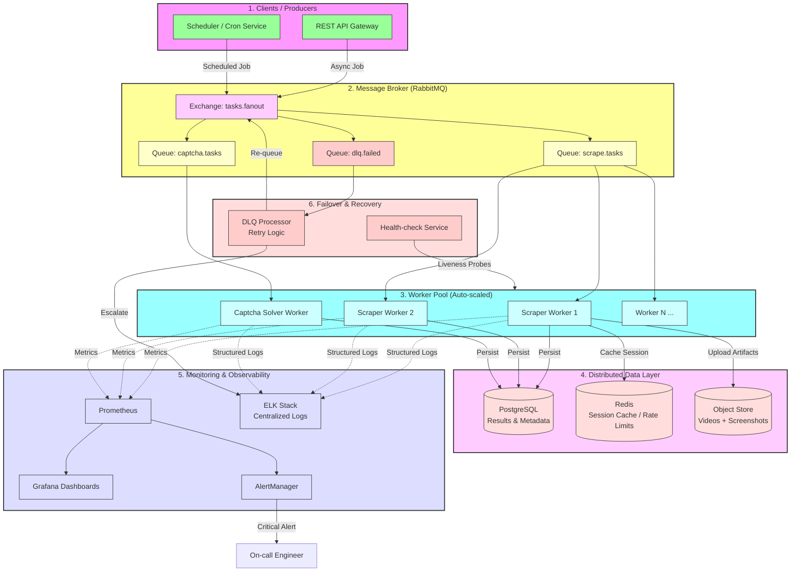

# Task 4: Scalable System Architecture

## 📌 Overview
This document outlines the architectural design for a distributed, horizontally scalable web automation and scraping system. The core focus of this design is **Resiliency**, **Observability**, and **Asynchronous Task Processing** to handle high-volume data extraction with automated failover mechanisms.

---

## 📊 System Architecture Diagram

The following diagram illustrates the data flow from task ingestion to persistence, including the monitoring and recovery layers.

---

## ⚙️ Component Descriptions

### 1. Message Distribution (RabbitMQ)
The system leverages **RabbitMQ** to achieve temporal decoupling between request ingestion and execution.
* **Exchange Logic:** Uses a `fanout` exchange to route tasks to specialized queues based on the task type (Scraping vs. Captcha solving).
* **Dead Letter Queue (DLQ):** Tasks that fail after maximum retries are routed to `dlq.failed` for manual inspection or automated escalation, preventing data loss.

### 2. Horizontal Scaling & Worker Pool
* **Worker Isolation:** Scraping and Captcha solving are separated into different pools to optimize resource allocation (as Captcha solving is more compute-intensive).
* **Elasticity:** Workers are containerized via **Docker** and managed by **Kubernetes HPA**, scaling dynamically based on **Queue Depth** (the number of pending tasks).

### 3. Monitoring & Observability Stack
* **System Health & Load:** **Prometheus** scrapes real-time metrics (CPU, RAM, Active Browser Contexts), while **Grafana** provides live visualization of the system's health.
* **Error Logging:** All workers emit structured JSON logs to an **ELK Stack** (Elasticsearch, Logstash, Kibana) for deep-dive debugging and trace analysis.

### 4. Failover & Resiliency Mechanisms
* **Automatic Redelivery:** If a worker node crashes mid-task, RabbitMQ detects the lost connection and automatically re-queues the message for another available worker.
* **State Recovery:** **PostgreSQL** manages structured data with streaming replication, while **Redis** handles ephemeral session states to ensure rapid recovery from node restarts.
* **Self-Healing:** A dedicated **Health-check Service** (Liveness Probes) automatically replaces unhealthy worker pods if a browser memory leak or hung process is detected.

---

## 🚀 Data Flow Summary

The end-to-end task lifecycle follows these steps:

1. **Request:** A client sends a `POST` request to the API Gateway.
2. **Queueing:** The task is validated and pushed to the **RabbitMQ Exchange**.
3. **Execution:** An available **Worker** pulls the task, launches a Playwright session, and handles data extraction or image/video processing.
4. **Persistence:** * Structured data is saved to **PostgreSQL**.
    * Media artifacts (videos/screenshots) are uploaded to **S3**.
    * Execution metrics are pushed to **Prometheus**.
5. **Acknowledge:** Upon successful completion, a `basic_ack` is sent to RabbitMQ to finalize and remove the task from the queue.

---

## 🤖 AI-Human Collaboration (Prompting Methodology)

The system's architecture was refined through a structured, iterative collaboration with LLMs, where I acted as the **Lead Systems Architect**. The process focused on maximizing the potential of the required stack:

### Phase 1: RabbitMQ Architecture Strategy
Instead of simple task passing, I directed the AI to design a sophisticated routing logic using **RabbitMQ**:
* **Prompting Logic:** I instructed the AI to implement a **Fanout Exchange** to decouple different task types (Scraping vs. Captcha) and specifically requested a **Dead Letter Queue (DLQ)** strategy to ensure "Poison Messages" don't cause infinite retry loops.

### Phase 2: Scaling & Data Integrity
I prompted for the integration of specific "Industry-Standard" components to support the message queue:
* **Dynamic Scaling:** I guided the AI to define a **Kubernetes HPA** logic that scales the Worker Pool based on **RabbitMQ Queue Depth** (messages ready) rather than just CPU usage, ensuring the system reacts to workload spikes in real-time.
* **Persistence Layer:** I specifically directed the AI to design a schema that links **RabbitMQ Message IDs** with **PostgreSQL Transactional Records** for full end-to-end traceability.

### Phase 3: Resiliency & Failover Refinement
To ensure the system met the "Failover and Recovery" requirement, I challenged the LLM to provide solutions for specific edge cases:
* **Worker Resilience:** Prompted for a configuration of **Manual Acknowledgments (ACK)** to ensure that if a worker crashes, RabbitMQ automatically re-queues the message.
* **System Health:** Directed the AI to implement **Liveness Probes** that monitor both the Worker process and its heartbeat connection to RabbitMQ.

> **Result:** This collaborative approach allowed for a rapid transition from basic requirements to a robust, enterprise-grade architecture, ensuring that RabbitMQ acts as a reliable backbone for the entire scaling operation.
